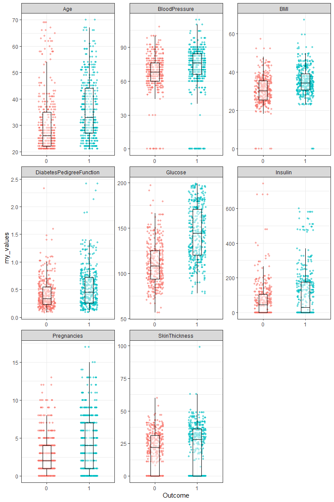
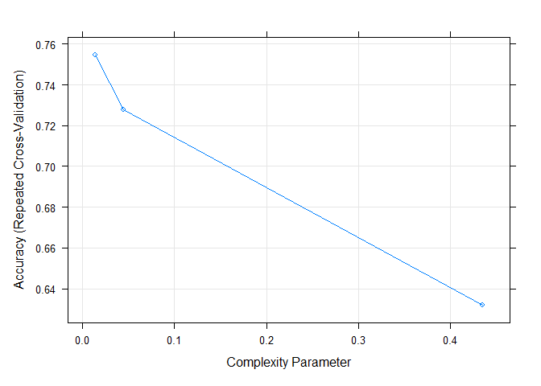
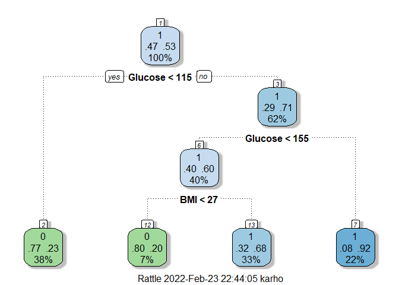

pima
================
Kar
23/02/2022

-   [1 Summary](#1-summary)
-   [2 R Packages](#2-r-packages)
    -   [3 Introduction](#3-introduction)
    -   [4 Data preparation](#4-data-preparation)
    -   [5 Data cleaning and
        transformation](#5-data-cleaning-and-transformation)
    -   [5.1 Transform outcome](#51-transform-outcome)
    -   [Data balancing](#data-balancing)
    -   [6 Data visualisation](#6-data-visualisation)
    -   [7 Machine learning](#7-machine-learning)
-   [8 Conclusion](#8-conclusion)
-   [9 Reference](#9-reference)

## 1 Summary

Hi Eetat

## 2 R Packages

``` r
library(tidyverse)
library(kableExtra)
library(skimr)
library(ROSE)
library(rpart)
library(rpart.plot)
library(caret)
library(rattle)
```

### 3 Introduction

### 4 Data preparation

The data used in this project is downloaded from kaggle website.

#### 4.1 Data import

Following code upload the data.

``` r
pima <- read.csv("diabetes.csv", na.strings = c("", NA))
```

Following show the first randomly selected 10 rows of observation. It
will be serve as an initial observation of the dataset.

``` r
sample_n(pima, 10)
```

    ##    Pregnancies Glucose BloodPressure SkinThickness Insulin  BMI
    ## 1            1     139            62            41     480 40.7
    ## 2            1      81            74            41      57 46.3
    ## 3            1      81            72            18      40 26.6
    ## 4            1      95            66            13      38 19.6
    ## 5            0     134            58            20     291 26.4
    ## 6            0      95            80            45      92 36.5
    ## 7            3      88            58            11      54 24.8
    ## 8            4     132             0             0       0 32.9
    ## 9            0     146            70             0       0 37.9
    ## 10           5     103           108            37       0 39.2
    ##    DiabetesPedigreeFunction Age Outcome
    ## 1                     0.536  21       0
    ## 2                     1.096  32       0
    ## 3                     0.283  24       0
    ## 4                     0.334  25       0
    ## 5                     0.352  21       0
    ## 6                     0.330  26       0
    ## 7                     0.267  22       0
    ## 8                     0.302  23       1
    ## 9                     0.334  28       1
    ## 10                    0.305  65       0

#### 4.2 Data exploration

The dataset has 768 rows of observation, and 9 columns of variables (or
known as “feature” or “predictor”). In the dataset, all of the 9
variables are numerical variables.

``` r
skim_without_charts(pima)
```

<table style="width: auto;" class="table table-condensed">
<caption>
Data summary
</caption>
<thead>
<tr>
<th style="text-align:left;">
</th>
<th style="text-align:left;">
</th>
</tr>
</thead>
<tbody>
<tr>
<td style="text-align:left;">
Name
</td>
<td style="text-align:left;">
pima
</td>
</tr>
<tr>
<td style="text-align:left;">
Number of rows
</td>
<td style="text-align:left;">
768
</td>
</tr>
<tr>
<td style="text-align:left;">
Number of columns
</td>
<td style="text-align:left;">
9
</td>
</tr>
<tr>
<td style="text-align:left;">
\_\_\_\_\_\_\_\_\_\_\_\_\_\_\_\_\_\_\_\_\_\_\_
</td>
<td style="text-align:left;">
</td>
</tr>
<tr>
<td style="text-align:left;">
Column type frequency:
</td>
<td style="text-align:left;">
</td>
</tr>
<tr>
<td style="text-align:left;">
numeric
</td>
<td style="text-align:left;">
9
</td>
</tr>
<tr>
<td style="text-align:left;">
\_\_\_\_\_\_\_\_\_\_\_\_\_\_\_\_\_\_\_\_\_\_\_\_
</td>
<td style="text-align:left;">
</td>
</tr>
<tr>
<td style="text-align:left;">
Group variables
</td>
<td style="text-align:left;">
None
</td>
</tr>
</tbody>
</table>

**Variable type: numeric**

<table>
<thead>
<tr>
<th style="text-align:left;">
skim\_variable
</th>
<th style="text-align:right;">
n\_missing
</th>
<th style="text-align:right;">
complete\_rate
</th>
<th style="text-align:right;">
mean
</th>
<th style="text-align:right;">
sd
</th>
<th style="text-align:right;">
p0
</th>
<th style="text-align:right;">
p25
</th>
<th style="text-align:right;">
p50
</th>
<th style="text-align:right;">
p75
</th>
<th style="text-align:right;">
p100
</th>
</tr>
</thead>
<tbody>
<tr>
<td style="text-align:left;">
Pregnancies
</td>
<td style="text-align:right;">
0
</td>
<td style="text-align:right;">
1
</td>
<td style="text-align:right;">
3.85
</td>
<td style="text-align:right;">
3.37
</td>
<td style="text-align:right;">
0.00
</td>
<td style="text-align:right;">
1.00
</td>
<td style="text-align:right;">
3.00
</td>
<td style="text-align:right;">
6.00
</td>
<td style="text-align:right;">
17.00
</td>
</tr>
<tr>
<td style="text-align:left;">
Glucose
</td>
<td style="text-align:right;">
0
</td>
<td style="text-align:right;">
1
</td>
<td style="text-align:right;">
120.89
</td>
<td style="text-align:right;">
31.97
</td>
<td style="text-align:right;">
0.00
</td>
<td style="text-align:right;">
99.00
</td>
<td style="text-align:right;">
117.00
</td>
<td style="text-align:right;">
140.25
</td>
<td style="text-align:right;">
199.00
</td>
</tr>
<tr>
<td style="text-align:left;">
BloodPressure
</td>
<td style="text-align:right;">
0
</td>
<td style="text-align:right;">
1
</td>
<td style="text-align:right;">
69.11
</td>
<td style="text-align:right;">
19.36
</td>
<td style="text-align:right;">
0.00
</td>
<td style="text-align:right;">
62.00
</td>
<td style="text-align:right;">
72.00
</td>
<td style="text-align:right;">
80.00
</td>
<td style="text-align:right;">
122.00
</td>
</tr>
<tr>
<td style="text-align:left;">
SkinThickness
</td>
<td style="text-align:right;">
0
</td>
<td style="text-align:right;">
1
</td>
<td style="text-align:right;">
20.54
</td>
<td style="text-align:right;">
15.95
</td>
<td style="text-align:right;">
0.00
</td>
<td style="text-align:right;">
0.00
</td>
<td style="text-align:right;">
23.00
</td>
<td style="text-align:right;">
32.00
</td>
<td style="text-align:right;">
99.00
</td>
</tr>
<tr>
<td style="text-align:left;">
Insulin
</td>
<td style="text-align:right;">
0
</td>
<td style="text-align:right;">
1
</td>
<td style="text-align:right;">
79.80
</td>
<td style="text-align:right;">
115.24
</td>
<td style="text-align:right;">
0.00
</td>
<td style="text-align:right;">
0.00
</td>
<td style="text-align:right;">
30.50
</td>
<td style="text-align:right;">
127.25
</td>
<td style="text-align:right;">
846.00
</td>
</tr>
<tr>
<td style="text-align:left;">
BMI
</td>
<td style="text-align:right;">
0
</td>
<td style="text-align:right;">
1
</td>
<td style="text-align:right;">
31.99
</td>
<td style="text-align:right;">
7.88
</td>
<td style="text-align:right;">
0.00
</td>
<td style="text-align:right;">
27.30
</td>
<td style="text-align:right;">
32.00
</td>
<td style="text-align:right;">
36.60
</td>
<td style="text-align:right;">
67.10
</td>
</tr>
<tr>
<td style="text-align:left;">
DiabetesPedigreeFunction
</td>
<td style="text-align:right;">
0
</td>
<td style="text-align:right;">
1
</td>
<td style="text-align:right;">
0.47
</td>
<td style="text-align:right;">
0.33
</td>
<td style="text-align:right;">
0.08
</td>
<td style="text-align:right;">
0.24
</td>
<td style="text-align:right;">
0.37
</td>
<td style="text-align:right;">
0.63
</td>
<td style="text-align:right;">
2.42
</td>
</tr>
<tr>
<td style="text-align:left;">
Age
</td>
<td style="text-align:right;">
0
</td>
<td style="text-align:right;">
1
</td>
<td style="text-align:right;">
33.24
</td>
<td style="text-align:right;">
11.76
</td>
<td style="text-align:right;">
21.00
</td>
<td style="text-align:right;">
24.00
</td>
<td style="text-align:right;">
29.00
</td>
<td style="text-align:right;">
41.00
</td>
<td style="text-align:right;">
81.00
</td>
</tr>
<tr>
<td style="text-align:left;">
Outcome
</td>
<td style="text-align:right;">
0
</td>
<td style="text-align:right;">
1
</td>
<td style="text-align:right;">
0.35
</td>
<td style="text-align:right;">
0.48
</td>
<td style="text-align:right;">
0.00
</td>
<td style="text-align:right;">
0.00
</td>
<td style="text-align:right;">
0.00
</td>
<td style="text-align:right;">
1.00
</td>
<td style="text-align:right;">
1.00
</td>
</tr>
</tbody>
</table>

From this table, I see that the dataset is very complete, because all
variables do not have missing value, all variables hav ethe
*complete\_rate* of 1.

Alternatively, I can check the NA by following code.

``` r
colSums(is.na(pima))
```

    ##              Pregnancies                  Glucose            BloodPressure 
    ##                        0                        0                        0 
    ##            SkinThickness                  Insulin                      BMI 
    ##                        0                        0                        0 
    ## DiabetesPedigreeFunction                      Age                  Outcome 
    ##                        0                        0                        0

From the above, I concluded that there is no missing data to manage.

Following show the basic statisics of these variables.

``` r
summary(pima)
```

    ##   Pregnancies        Glucose      BloodPressure    SkinThickness  
    ##  Min.   : 0.000   Min.   :  0.0   Min.   :  0.00   Min.   : 0.00  
    ##  1st Qu.: 1.000   1st Qu.: 99.0   1st Qu.: 62.00   1st Qu.: 0.00  
    ##  Median : 3.000   Median :117.0   Median : 72.00   Median :23.00  
    ##  Mean   : 3.845   Mean   :120.9   Mean   : 69.11   Mean   :20.54  
    ##  3rd Qu.: 6.000   3rd Qu.:140.2   3rd Qu.: 80.00   3rd Qu.:32.00  
    ##  Max.   :17.000   Max.   :199.0   Max.   :122.00   Max.   :99.00  
    ##     Insulin           BMI        DiabetesPedigreeFunction      Age       
    ##  Min.   :  0.0   Min.   : 0.00   Min.   :0.0780           Min.   :21.00  
    ##  1st Qu.:  0.0   1st Qu.:27.30   1st Qu.:0.2437           1st Qu.:24.00  
    ##  Median : 30.5   Median :32.00   Median :0.3725           Median :29.00  
    ##  Mean   : 79.8   Mean   :31.99   Mean   :0.4719           Mean   :33.24  
    ##  3rd Qu.:127.2   3rd Qu.:36.60   3rd Qu.:0.6262           3rd Qu.:41.00  
    ##  Max.   :846.0   Max.   :67.10   Max.   :2.4200           Max.   :81.00  
    ##     Outcome     
    ##  Min.   :0.000  
    ##  1st Qu.:0.000  
    ##  Median :0.000  
    ##  Mean   :0.349  
    ##  3rd Qu.:1.000  
    ##  Max.   :1.000

### 5 Data cleaning and transformation

### 5.1 Transform outcome

The outcome varialbe has to be in factor type instead of numeric.
Therefore following code complete the conversion.

``` r
pima <- pima %>% 
  mutate(Outcome = as.factor(Outcome))
```

Lets check.

``` r
summary(pima)
```

    ##   Pregnancies        Glucose      BloodPressure    SkinThickness  
    ##  Min.   : 0.000   Min.   :  0.0   Min.   :  0.00   Min.   : 0.00  
    ##  1st Qu.: 1.000   1st Qu.: 99.0   1st Qu.: 62.00   1st Qu.: 0.00  
    ##  Median : 3.000   Median :117.0   Median : 72.00   Median :23.00  
    ##  Mean   : 3.845   Mean   :120.9   Mean   : 69.11   Mean   :20.54  
    ##  3rd Qu.: 6.000   3rd Qu.:140.2   3rd Qu.: 80.00   3rd Qu.:32.00  
    ##  Max.   :17.000   Max.   :199.0   Max.   :122.00   Max.   :99.00  
    ##     Insulin           BMI        DiabetesPedigreeFunction      Age       
    ##  Min.   :  0.0   Min.   : 0.00   Min.   :0.0780           Min.   :21.00  
    ##  1st Qu.:  0.0   1st Qu.:27.30   1st Qu.:0.2437           1st Qu.:24.00  
    ##  Median : 30.5   Median :32.00   Median :0.3725           Median :29.00  
    ##  Mean   : 79.8   Mean   :31.99   Mean   :0.4719           Mean   :33.24  
    ##  3rd Qu.:127.2   3rd Qu.:36.60   3rd Qu.:0.6262           3rd Qu.:41.00  
    ##  Max.   :846.0   Max.   :67.10   Max.   :2.4200           Max.   :81.00  
    ##  Outcome
    ##  0:500  
    ##  1:268  
    ##         
    ##         
    ##         
    ## 

### Data balancing

There is imbalance problem in this dataset. In responding variable,
there is only 34.9% of observations belong to the group “1”.

``` r
268/768
```

    ## [1] 0.3489583

Following code complete the balancing using BOTH sampling.

``` r
pima <- ovun.sample(Outcome ~., 
                          data = pima, 
                          method = "both")$data # total samples of train set
```

Let see the outcome.

``` r
table(pima$Outcome)
```

    ## 
    ##   0   1 
    ## 361 407

### 6 Data visualisation

Following the variables to explore.

``` r
names(pima)
```

    ## [1] "Pregnancies"              "Glucose"                 
    ## [3] "BloodPressure"            "SkinThickness"           
    ## [5] "Insulin"                  "BMI"                     
    ## [7] "DiabetesPedigreeFunction" "Age"                     
    ## [9] "Outcome"

``` r
# pivoting

pima2 <- pima %>% 
  pivot_longer(c(1:8), 
               values_to = "my_values",
               names_to = "my_variables")

# plot the graph

ggplot(pima2, aes(x = Outcome, y = my_values, colour = Outcome)) +
  geom_jitter(width = 0.2, alpha = 0.5, size = 1) +
  geom_boxplot(size = 0.2, width = 0.2, 
               colour = "black", 
               alpha = 0.5, 
               outlier.shape = NA) +
  theme_bw() +
  theme(legend.position = "NONE") +
  facet_wrap(~my_variables, scales = "free")
```

<!-- -->

### 7 Machine learning

#### 7.1 Data partitioning

``` r
# Making the index

ind <- pima$Outcome %>% createDataPartition(p = 0.8, list = F)

# Create train and test sets

train.set <- pima[ind, ]
test.set <- pima[-ind, ]
```

#### 7.2 Model building

``` r
# Model building

model_dt <- train(Outcome ~., 
                  data = pima,
                  method = "rpart",
                  trControl = trainControl(method = "repeatedcv",
                                           number = 10,
                                           repeats = 3))
```

``` r
plot(model_dt)
```

<!-- -->

``` r
fancyRpartPlot(model_dt$finalModel)
```

<!-- -->

``` r
# prediction

pred <- model_dt %>% predict(test.set)

# accuracy 

mean(pred == test.set$Outcome)
```

    ## [1] 0.751634

## 8 Conclusion

## 9 Reference

UCI Machine learning 2017, *Pima Indians Diabetes Database*, viewed 23
February 2022,
<https://www.kaggle.com/uciml/pima-indians-diabetes-database?select=diabetes.csv>
